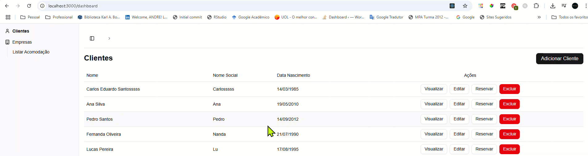

## Atividade IV

Empresa criada: Ocean Solutions

Fundador, Dev e Engenheiro de Software: André Salerno

## Atividade

"Portanto, você decidiu desenvolver uma interface para uma aplicação  do  tipo  Single  Page  Application  (SPA).  SPAs  são  aplicações  cuja  funcionalidade  está concentrada em uma única página.

O  objetivo  agora  é  construir  um  protótipo  navegável  para  a  futura  aplicação  SPA.  Você  pode escolher  ou  se  basear  em  qualquer  framework  para  construção  da  interface,  mas  lembre-se, esta interface precisa ser amigável, com ótima usabilidade.

Um ponto importante, o protótipo navegável deve contemplar todas as funcionalidades que já existem  no  sistema  CLI,  como  o  CRUD  de  clientes  (hospedes),  cadastro  de  acomodações  e registro de hospedagens."

## Como rodar o sistema

1. Clone o repositório
2. Abra o terminal e navegue até a pasta do projeto
3. Execute o comando `npm install` para instalar as dependências
4. Execute o comando `npm run dev` para iniciar o servidor
5. Abra o navegador e acesse: http://localhost:3000/dashboard

## Tecnologias utilizadas (frameworks e bibliotecas)

- React
- Next.js
- Tailwind CSS
- Shadcon UI

## Dados

Esses foram mockados e eocntram-se em: ./src/lib/mocks

## Funcionalidades

- Cadastro de clientes (hospedes)

- Ediar clientes (hospedes)

- Excluir clientes (hospedes)

- Reservar ocupação (hospedes)

- Tipos de acomodações (quartos)

- Associar acomodação

